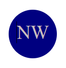
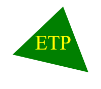

# Command Line Logo Generator
    

--- 
## Description
The purpose of this project was to develop a Node.js application that takes user input from command line prompts generated by the Inquirer package and generates a simple geometric logo in a new logo.svg file. This allows project creates to quickly and easily generate a logo image for any component of their project. The project was a component of the Berkeley Fullstack Flex Web Development coding bootcamp.

---
## Table of Contents
* [Description](#description)
* [Preview](#preview)
* [Technologies Used](#technologies-used)
* [Installation](#installation)
* [Usage](#usage)
* [Features](#features)
* [Contact](#contact)
* [License](#license)
* [Credits](#credits)

---
## Preview 
Circle-shaped logo

 

---
Square-shaped logo

---
Triangle-shaped logo

---
Video Demonstration

[video](https://drive.google.com/file/d/1GcvUFcy307hlfiKHa0nG5Fchufj7hOQb/view) 

---
## Technologies Used
-  JavaScript
-  Node.js v18.12.1
-  Inquirer v8.2.5
-  Jest v29.5.0

---
## Installation
  1. [Clone](https://github.com/sarah-jensen/logo-generator) or [download](https://github.com/sarah-jensen/logo-generator/archive/refs/heads/master.zip) the repository to your computer. 
  2. Install the necessary packages: [node.js v18.12.1](https://nodejs.org/en)
  3. Open the `Develop` directory in your terminal (or Integrated Terminal if using VS Code) 
  4. Type `npm init -y` in the command line to install `node_modules`
  5. Type `npm i inquirer@8.2.4 jest` to install the `inquirer` and `jest` packages. 
  6. Run the application by typing `node index` in the command line.

---
## Usage
 After following Installation instructions and running the application, the logo.svg file will be automatically added to the `logo-generator` directory. You may copy and paste the file to the repo for your project. Be aware that each time the application is run, the previously generated `logo.svg` will be overwritten. To avoid losing your previously generated logos, it is recommended you rename the file and/or move it to another directory.

---
## Features 

- The logo can be created in the shape of a `circle`, `square`, or `triangle`.
- The generator ensures all text characters are rendered in capital letters to ensure even spaceing and placement within the logo area.
- The application incorporates  tests to ensure that the SVG file is generated correctly based on user input.

---
## Contact
If you have any questions or issues with the repo, please reach out to "[sarah-jensen]("https://github.com/sarah-jensen")" or create an issue in the "["repo"](https://github.com/sarah-jensen/logo-generator)".

---
## License
This project is open source and available under the [MIT](./LICENSE)

## Credits
License badges created by [shields.io](https://shields.io/) 